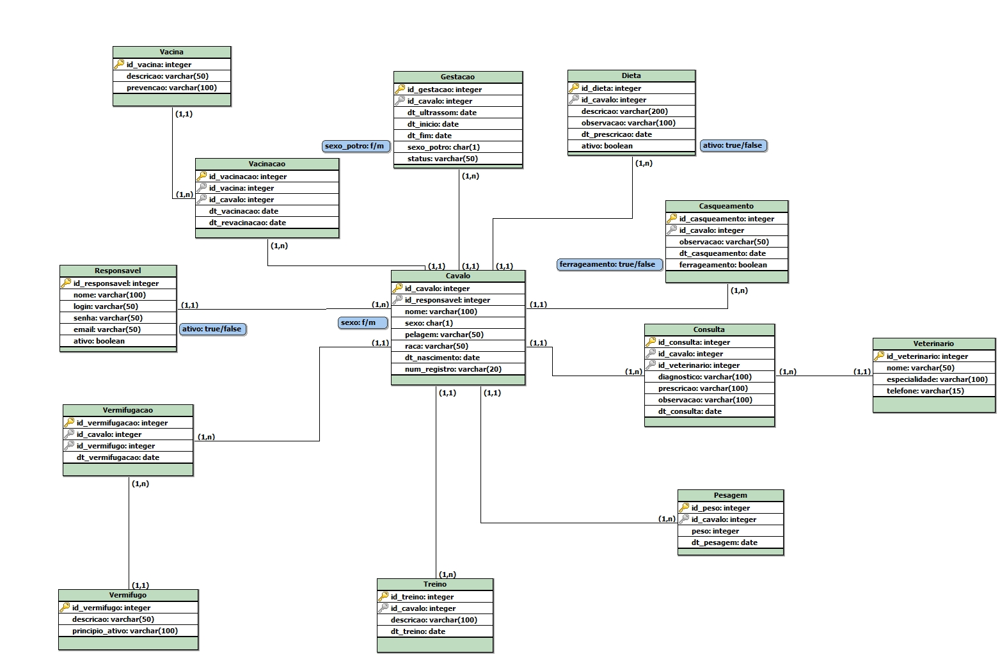

# Projeto de Gestão de Equinos

Este projeto foi desenvolvido como parte da disciplina de Fundamentos de Banco de Dados da faculdade, com o objetivo de modelar e gerenciar um sistema de gestão de equinos. O sistema busca gerenciar o histórico do cavalo, controlando questões essenciais como vacinação e vermifugação, treinos, dietas, casqueamentos, entre outros.

---
## Modelo Lógico

## Estrutura do Repositório
* `schema.sql`: Contém os comandos SQL para criar a estrutura do banco de dados.
* `data_population.sql`: Contém os comandos `INSERT INTO` para popular o banco de dados com dados de exemplo.
* `queries.sql`: Contém consultas de exemplo que demonstram a funcionalidade do banco.

## Como Usar
Siga os passos abaixo para configurar e usar o banco de dados:

1.  **Crie o banco de dados:** Abra o `schema.sql` no seu SGBD e execute o script para criar a estrutura das tabelas.
2.  **Popule o banco:** Em seguida, execute os comandos do `data_population.sql` para inserir os dados de exemplo.
3.  **Execute as consultas:** Agora você pode usar as consultas de exemplo do `queries.sql` para testar o banco de dados.

---

## Tecnologias Utilizadas
* **Linguagem:** SQL
* **Sistema de Gerenciamento de Banco de Dados (SGBD):** PostgreSQL

## Autor
* Karla Liliam Alves Fonseca
* https://www.linkedin.com/in/karla-liliam/
